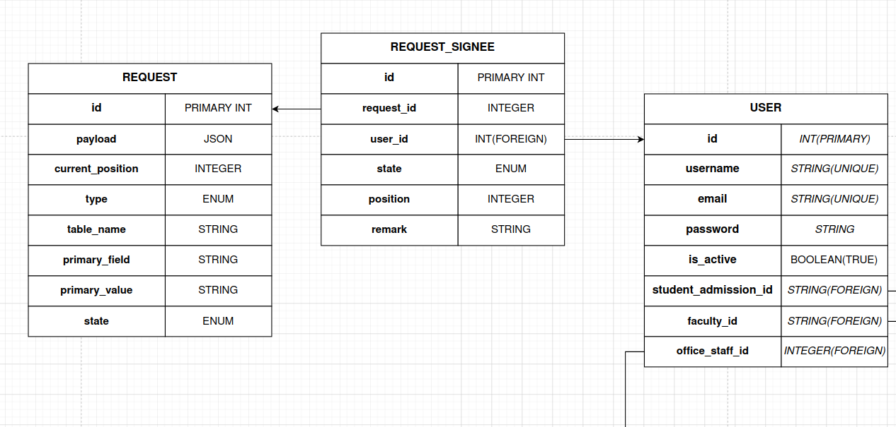

# Request System

A detailed explanation of the request system and its API, which is the backbone of Semester Registration.

Quick Note: This system is best implemented in a NoSQL DB, but due to technological limitations we implemented a NoSQL in an SQL System with a ton of redundancies.

## Table of Contents
- [Tables](#tables)
- [Process Flow](#process-flow)
- [Working Example](#)
- [The API](#the-api)
    - [RequestStates Enum](#appenumsrequeststates)
    - [RequestTypes Enum](#appenumsrequesttypes)
    - [Create Request](#requestmodelcreatenewrequeststring-type-model-model-string-primaryval-array-payload-array-signees-void)
    - [Current Signee](#requestmodelcurrentsignee-requestsignee)
    - [Is Last Request Pending](#requestmodelislastrequestispendingstring-requesttype-string-primaryval-bool)
    - [Perform Updation](#requestmodelperformupdation-void)
    - [Reject](#requestmodelrejectremark-void)
    - [Set Next Signee](#requestmodelsetnextsigneeremark-bool)

### Tables



### Process flow

The process flow for student uploading an image.

1. Student with admission id 19brxxxxx, uploads the image in [PhotoUploadController@create](../src/app/Http/Controllers/PhotoUploadController.php)
2. A new request is generated with the student's staff advisor as the only signee.
```
{
    "id": 1,
    "type": STUDENT_PHOTO_UPLOAD,
    "signees": [
        {
            "user_id": <staff_advisor_user_id>,
            "request_id": 1,
            "position": 1,
            "state": PENDING,
            "remark": null
        }
     ],
     "state": PENDING,
     "current_position": 1,
     "payload": {"photo_url": "<new_url>"},
     "table_name": "students",
     "primary_field": "admission_id",
     "primary_value": "19brxxxxx"
}
```
3. Now the request will be visible in the [RequestController@index](../src/app/Http/Controllers/RequestController.php) for this staff advisor.
4. If the staff advisor approves the request, their `state` would be changed to "approved".
5. Since he's the last and only signee, this request is approved, and the `state` would change to "approved" and a database query will be built from `table_name`, `primary_field`, `primary_value`, and `payload`.
Basically all the changes in the `payload` would be reflected in the student's table.

This is a double edged sword, while this method simplifies things for us, it also creates a major security hole.

The profile identified from `table_name`, `primary_field` and `primary_value`, would be updated with the `payload`. 

So it is important to ensure that all these attributes can't be edited after creating and proper validation must be performed before creating a request.


### Working Example

Goto `/testrequest` as student to see a working example where the student can apply to change their name.

It goes through staff_advisor -> HOD -> Principal.

Goto `/requests?mode=applicant` as the same student to see the status of your application.

Goto `/requests` as staff_advisor after you create the request and approve it.

Repeat the same as HOD and Principal

After Principal approves, check student's name. It would be changed.

### The API

Since this structure has a lot of redundancies, its recommended that you interact with this API. 

**NOTE: None of these functions have object level permission validations, so only call these functions after performing them.**

#### `\App\Enums\RequestStates`

Enum containing all possible states

#### `\App\Enums\RequestTypes`

Enum containing all possible types of requests

#### `RequestModel::createNewRequest(..args): void`

Function to create a new request and its signees.

- `type` - Type Of Request, Use `RequestTypes::NAME_OF_REQUEST`
- `model` - An instance of the model used in the payload, eg: `new Student()`
- `primaryVal` - The Primary Key of the payload row.
- `payload` - An array of key, value pairs containing the changes to be made in the row identified by `primaryVal` 
- `signees` - An array of `user id` of signees. eg: `[1, 2, 3]`
- `checkSpam` - Default is `true`. If `true`, it checks if the last request submitted by the same applicant is pending before creating a new request.

#### `RequestModel.currentSignee(): RequestSignee`

Function to return the current signee's signee instance.

#### `RequestModel::isLastRequestIsPending(string $requestType, string $primaryVal): bool`

Function to check if the same request earlier requested by the same user is still pending.

- `primaryVal` - The Primary Key of the payload row.
- `requestType` - Type Of Request, Use `RequestTypes::NAME_OF_REQUEST`

#### `RequestModel.performUpdation(): void`

Execute the query using `payload`, `table_name`, `primary_field` and `primary_value`.

**WARNING: DONT EXECUTE THIS WITHOUT VALIDATION**

#### `RequestModel.reject($remark): void`

Function to reject a request.

#### `RequestModel.setNextSignee($remark): bool`

Function to shift to the next signee, returns true if all signees approved, false otherwise